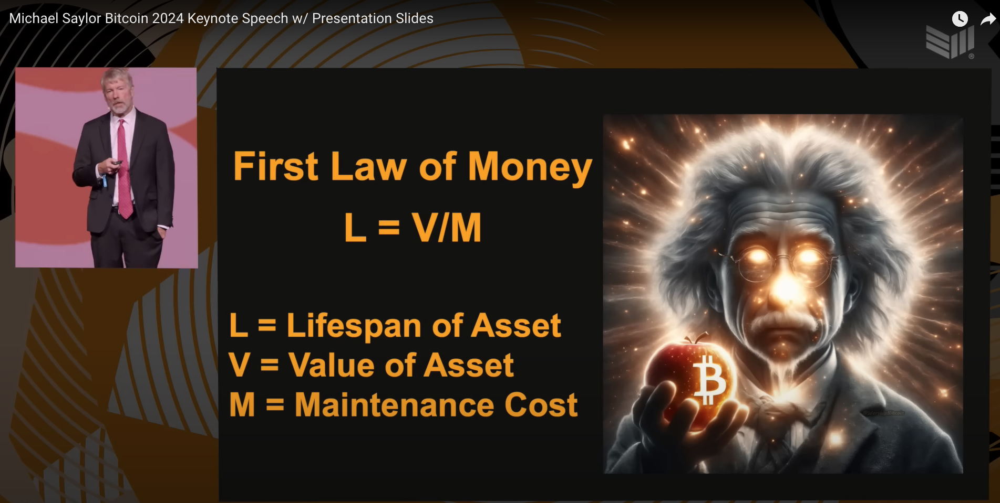

# SaylorScope: Advanced Financial Analysis Tool

SaylorScope is a premier calculator for figuring out the first law of money. It is designed to help with financial analysis and wealth building, inspired by Michael Saylor\'s speech at the 2024 Bitcoin Conference in Nashville.



## Getting Started

### Prerequisites

Ensure you have [Node.js](https://nodejs.org/en/) installed on your machine. This project requires Node.js version 18.17.0 or higher.

### Installation

Clone the repository and install the dependencies:

```bash
git clone https://github.com/Chepenik/saylorscope.git
cd saylorscope
npm install 
Running the Development Server
To start the development server, run:

bash
Copy code
npm run dev
# or
yarn dev
# or
pnpm dev
# or
bun dev
Open http://localhost:3000 with your browser to see the result.
```

Editing the Project
You can start editing the page by modifying app/page.tsx. The page auto-updates as you edit the file.

Features

Calculates the lifespan, ROI, and time it takes to double your money for various asset types.
Visual representation of the initial and projected values using Chart.js.
Supports physical, digital, and financial assets.
Tip button to support the project.

Deploy on Vercel

The easiest way to deploy your Next.js app is to use the Vercel Platform from the creators of Next.js: https://github.com/vercel/next.js/

Check out the Next.js deployment documentation for more details.

Future Work

Enhancements I'd like to build for SaylorScope:

Optimize for Mobile: Ensure the application is fully responsive and optimized for mobile devices.
Add a Database: Integrate a database to store user data, asset information, and analysis results.
User Authentication: Implement a login system for users to save and manage their assets and analysis over multiple sessions.
Improve UX: Continuously improve the user experience with a more intuitive interface and better feedback mechanisms.
Additional Financial Metrics: Add more advanced financial metrics and analysis tools to provide deeper insights.
Export Options: Provide options to export analysis results in various formats (PDF, Excel, etc.).
Make a paid version with access to the internet that prepopulates the data and fetches it from yahoo finance, etc, offer best estimates

License

This project is licensed under the MIT License - see the LICENSE file for details. Please feel free to make a pull request and contribute if you have ideas to improve SaylorScope

Acknowledgments

This project was inspired by Michael Saylor's presentation at the 2024 Bitcoin Conference in Nashville.